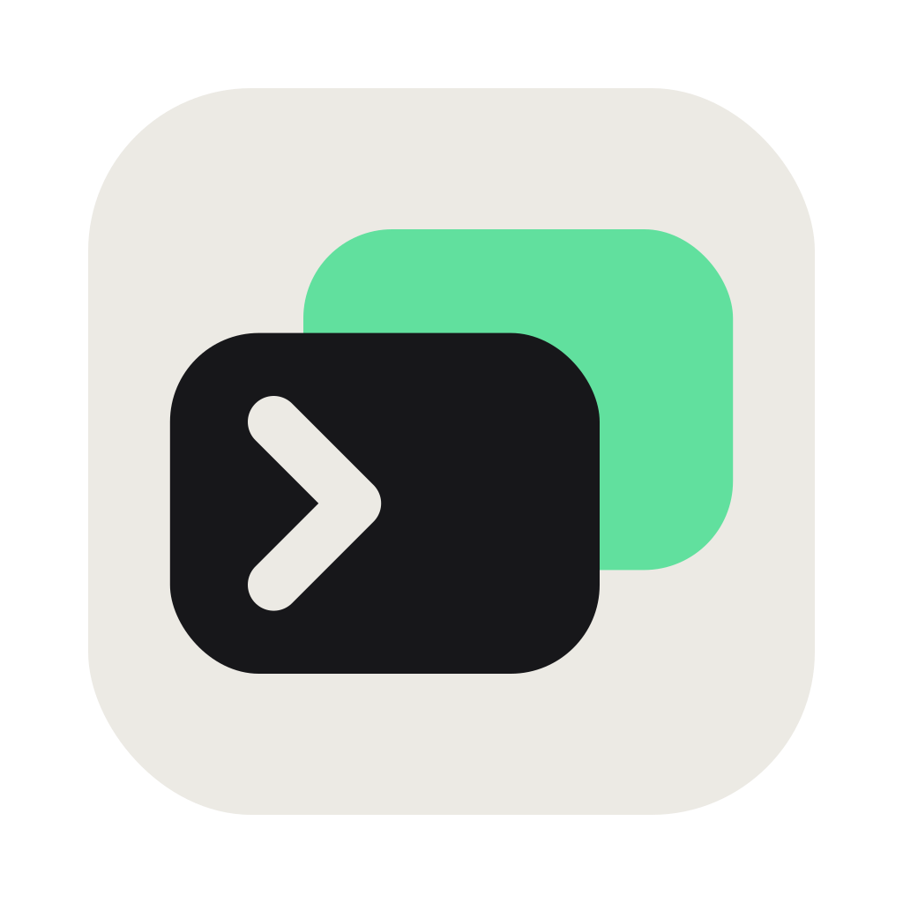

### tty7

**A terminal workbench: shells, sessions, SSH, coding agents.**

Pure Rust · GPU rendering on Zed's gpui · VT core from Alacritty

 

English · [简体中文](README.zh-CN.md)

## Why

- **Fast** — ~2× the throughput of Alacritty, Ghostty, or Kitty ([benchmarks](#benchmarks))
- **Sessions persist** — quit or reboot; your shells keep running, no tmux
- **Editor-grade input** — completion, syntax highlighting, history search built in; zero config for zsh, bash, fish, PowerShell
- **Agent-aware** — recognizes Claude Code & co. in a pane: status, notifications, session resume

## Install

Native builds for each platform on [**Releases**](https://github.com/l0ng-ai/tty7/releases):

| | | |
|---|---|---|
| **macOS** | `…-macos-arm64.dmg` · `…-x86_64.dmg` | drag into Applications |
| **Windows** | `…-setup.exe` · portable `….zip` | |
| **Linux** | `…-x86_64.AppImage` | `chmod +x` and run — x11/wayland libs bundled |

## What's inside

| | |
|---|---|
| **Input** | ghost suggestions from history · explained tab completion · syntax highlighting · multi-line editing · click places the caret · <kbd>⌃ R</kbd> fuzzy history |
| **Window** | tabs & splits · <kbd>⌘ P</kbd> palette · <kbd>⌘ F</kbd> scrollback search · eight themes · IME |
| **Coding agents** | per-pane agent detection (~17 CLIs): status dot, notifications, branch + diff, resume after reboot, tray icon that signals "needs your input" |
| **SSH** | native russh stack: profiles with keychain secrets, SFTP panel, port forwarding, jump hosts |

Details for every row: [docs/features.md](docs/features.md). Keybindings: <kbd>⌘ ,</kbd>
opens Settings — browse and remap everything, tmux preset included
([full list](docs/features.md#keybindings)).

## Benchmarks

Same machine, same day, same 155×40 grid — Apple M1 Pro, macOS 26.3.1,
five-run averages (2026-07-04):

| | **tty7** | Alacritty | Ghostty | Kitty |
|---|---:|---:|---:|---:|
| Plaintext IO — 11 MB `cat` (lower = better) | **95 ms** | 239 ms | 179 ms | 185 ms |
| [DOOM-fire](https://github.com/const-void/DOOM-fire-zig) frame rate (higher = better) | **888 fps** | 485 fps | 552 fps | 617 fps |
| Cold-launch memory | 116 MB¹ | 105 MB | 128 MB | 130 MB |

¹ GUI 105 MB + the persistent daemon 11 MB.

Methodology and one-command reproduction: [`scripts/bench/`](scripts/bench/README.md).

---

Built on [gpui](https://github.com/zed-industries/zed) and [`alacritty_terminal`](https://github.com/zed-industries/alacritty) · [Apache-2.0](LICENSE) · [Discord](https://discord.gg/s3dethqz2V) · [Changelog](CHANGELOG.md)

